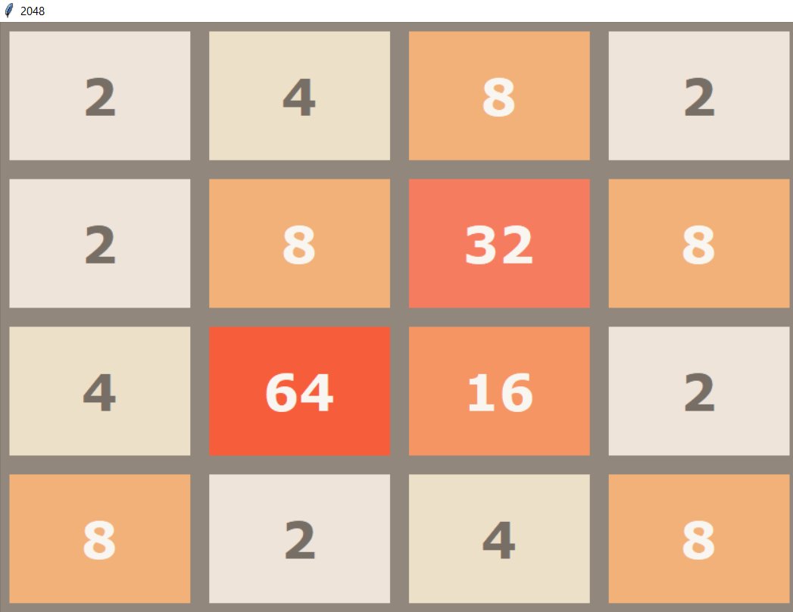

This is an Implementation of one of the most famous game 2048 Game. For Information regarding the game Click the below Link.

https://en.wikipedia.org/wiki/2048_(video_game)

For Running the Game just clone the code and run python.py

For moving the blocks use W(UP),A(LEFT),S(DOWN),D(RIGHT)
